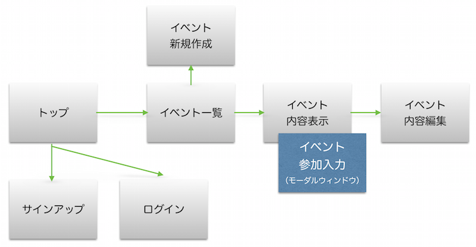

# 俺の調整さん

## 概要

打ち合わせや飲み会などのイベントに出席する候補者の都合を聞いて、日程・時間を調整するためのWebアプリ。

- [本家サンプル](https://chouseisan.com/s?h=028c5bfdf74c4912a6b2a697c4fed4a3)
- [コピーアプリ (Heroku)](https://dry-basin-5475.herokuapp.com/events/e770a86069561b98d0078d5df057d9ae)
- [GitHubコード](https://github.com/ermtmt/choseisan.git)

## 機能

- 本家とは異なり、ユーザー管理する。
- ユーザーは出欠表を作ることができる。
    - イベントの名前をつけられる。（必須）
    - イベントのメモを設定できる。
    - 候補日程を設定できる。（必須）
    - 候補日程は改行で複数設定できる。
    - 出欠表を作成すると、アクセス用URLが生成される。
    - イベント情報本体の変更（再編集・削除）はイベント作成者のみ可能。
- ハッシュURLを知っている人は誰でもイベント出欠表にアクセスし、イベント情報を閲覧できる。
    - 出欠表の一覧は、各候補日での回答者の出欠状況に応じ、以下の判定どおりに行の背景色が変化する。
        - 全員が×だと背景色がつかない。
        - 全員が○だと濃いグリーンで表示される。
        - それ以外は薄いグリーン。
    - さらにログインすれば以下のことが可能。
        - 自分の出欠を記入できる。
        - 出欠入力は候補に対してそれぞれ○、△、×で設定する。
        - 出欠とともにコメントを設定できる。
        - １度記入した出欠入力の更新入力も可能。

#### 本家には機能として存在するが、実装しないもの

- 1ヶ月誰も更新しなかったイベントは、自動的に削除される。
- ガラケー表示対応。
- 出欠表のダウンロード。

## ERD

## 画面遷移

- ログインレスでもイベントの内容表示画面はアクセス可能。
