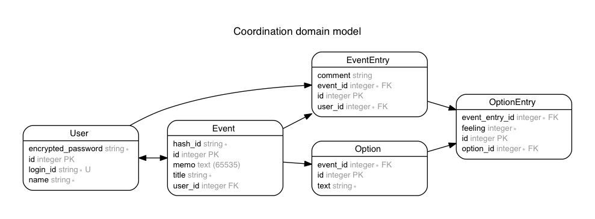
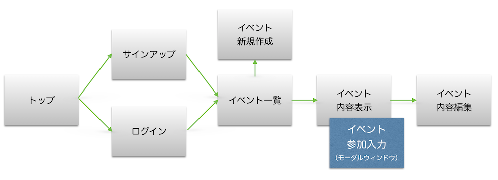

# 俺の調整さん

## 概要

打ち合わせや飲み会などのイベントに出席する候補者の都合を聞いて、日程・時間を調整するためのWebアプリ。

- [本家サンプル](https://chouseisan.com/s?h=028c5bfdf74c4912a6b2a697c4fed4a3)
- [コピーアプリ (Heroku)](https://dry-basin-5475.herokuapp.com/events/e770a86069561b98d0078d5df057d9ae)
- [GitHubコード](https://github.com/ermtmt/choseisan.git)

## 機能

- ユーザー管理（認証・認可）を行う。
- ハッシュURLを知っている人は誰でもイベント出欠表にアクセスし、イベント情報を閲覧できる。
    - 出欠入力は各候補日に対して○、△、×で回答。
    - 出欠入力とともに回答者のコメントも表示。
    - 出欠表の一覧は、各候補日での回答者の出欠状況に応じ、以下の判定どおりに行の背景色が変化する。
        - 全員が○だと濃いグリーン。（100%）
        - 出席率が70%以上だと薄いグリーン。（○=100点、△=50点、×=0点）
        - それ以下は白。
    - ログインすれば以下のことが可能。
        - 自分の出欠とコメントを記入できる。
        - １度記入した出欠の変更入力も可能。
-  ユーザーは、出欠表を最大20個まで作ることができる。
    - イベントの名前をつけられる。（必須）
    - イベントのメモを設定できる。
    - 候補日程を複数設定できる。（必須）
    - 出欠表を作成すると、アクセス用のハッシュURLが生成される。
    - イベント情報本体の変更（再編集・削除）はイベント作成者のみ可能。
- ユーザーは、自分のタグを最大５個まで作ることができる。
    - ヘッダーメニューからタグ管理機能へ移動する。
    - タグに任意の名前をつけられる。（必須）
    - タグに色（６色から選択）をつけられる。（必須）
    - 作ったタグの内容変更・削除も可能。
    - タグを任意のイベントに付けたり、はがしたりできる（イベント内容画面）。
    - 付けたタグでイベントをフィルターできる（イベント一覧画面）。

#### 本家には機能として存在するが、実装しないもの

- 1ヶ月誰も更新しなかったイベントは、自動的に削除される。
- ガラケー表示対応。
- 出欠表のダウンロード。

#### 本家にはない機能

- ユーザー管理（認証・認可）。
- ユーザーごとのタグ管理・タグ付け機能。

## ERD

## 画面遷移

- ログインレスでもイベント内容表示画面はアクセス可能。
